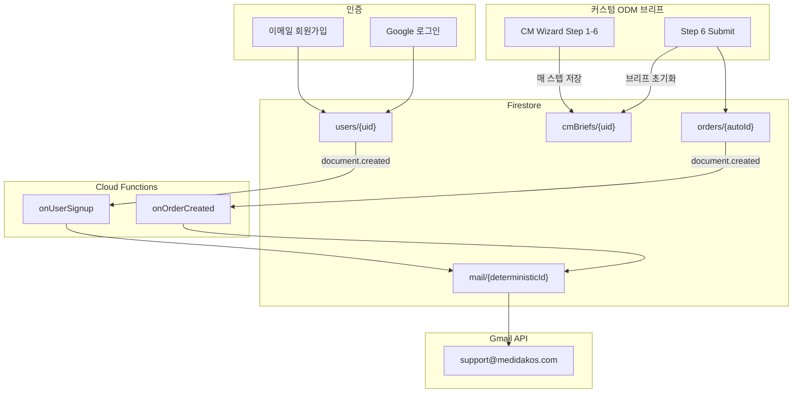

# Firebase 컬렉션 & 메일 발송 정리

Medi Da Kos 프로젝트의 Firestore 컬렉션별 저장 시점, 필드, UI 진입점과 Cloud Functions가 `mail` 컬렉션에 큐잉하는 트리거·메일 양식을 정리한 문서입니다.

## 전체 데이터 흐름



**핵심:** Functions가 `mail` 문서를 예약한 뒤 Gmail API로 발송한다. Trigger Email 확장·SMTP는 쓰지 않는다.  
`cmBriefs`는 직접 메일을 보내지 않는다. 같은 `queueEmail()`을 contact·landingRequests·lifecycleScan도 쓴다.

---

## 1. Firestore 컬렉션별 저장 시점

### `users/{uid}` — 회원 프로필

| 항목 | 내용 |
|------|------|
| **문서 ID** | Firebase Auth `uid` |
| **저장 시점** | 이메일 회원가입 직후, Google 로그인 직후 |
| **호출 코드** | `src/lib/auth-context.tsx` → `saveUserProfile()` |
| **저장 방식** | `setDoc` (merge 없음 — 전체 덮어쓰기) |

**주요 필드** (`src/lib/types.ts`):

- `uid`, `email`, `displayName`, `phone`, `country`, `companyName`
- `provider`: `"email"` \| `"google"`
- `role`: `"user"` (기본)
- `createdAt`

**주의:**

- Mock 모드(`useMockAuth() === true`)면 Firestore에 **저장 안 함** → 메일도 없음
- Google **재로그인** 시 `setDoc`은 **업데이트** → `onDocumentCreated` **재실행 안 됨**
- 메일은 **`users` 문서가 처음 생성될 때 1회**만

---

### `cmBriefs/{uid}` — CM Wizard 작업 중 브리프 (임시 저장)

| 항목 | 내용 |
|------|------|
| **문서 ID** | 사용자 `uid` (1인 1문서) |
| **저장 시점** | 대시보드 CM Wizard 각 스텝 이동/저장 시 |
| **호출 코드** | `src/lib/dashboard-brief-context.tsx` → `saveCMBrief()` |
| **메일 트리거** | **없음** |

**주요 필드:**

- `uid`, `currentStep` (1~6), `requestType`: `"custom"`
- `status`: `"draft"` (작업 중) — 제출 후에는 `resetCMBriefDraft()`로 다시 `"draft"` + 필드 삭제
- `step1` ~ `step6`: 위저드 각 단계 데이터
- `createdAt`, `updatedAt`, `serverUpdatedAt`

**역할:** 사용자가 Step 6까지 작성하는 **진행 중인 초안**. 제출해도 `orders.briefSnapshot`에 복사되고, `cmBriefs`는 빈 draft로 리셋됩니다.

---

### `sampleRequests/{requestId}` — (레거시) Top 10 샘플 요청

대시보드 Top 10 샘플 오더 UI는 제거되었습니다. 앱은 더 이상 이 컬렉션에 쓰지 않습니다.  
기존 문서는 어드민 인입 목록·라이프사이클 스캔에서 읽기만 합니다.

---

### `orders/{orderId}` — 주문 요약 (대시보드 + 메일 트리거)

| 항목 | 내용 |
|------|------|
| **문서 ID** | Firestore auto ID |
| **저장 시점** | CM Wizard Step 6 제출 |
| **메일 트리거** | **`onOrderCreated`** → `mail` 2종 (관리자 + 고객) |

#### 커스텀 ODM 주문 — `submitCustomBrief()` (`CMWizard.tsx`)

```
orders 추가 (briefSnapshot 포함) → cmBriefs 초기화
```

| 필드 | 값 예시 |
|------|---------|
| `type` | `"custom"` |
| `title` | `"Custom ODM — Skin Care"` 또는 `"Cosmetic"` |
| `summary` | `"Order quantity: 5,000 · Volume: 50 ml · Packaging: ..."` (수량 미정 시 `"Order quantity: TBD"`) |
| `referenceId` | `"custom-{uid}-{timestamp}"` |
| `briefSnapshot` | 제출 시점 브리프 전체 (step3 logo binary 제외) |
| `status` | `"submitted"` |

**메일에서의 구분** (`functions/index.js`): 기존 `type === "sample"` 주문은 제목 `[샘플 주문]`, 신규 커스텀 주문은 `[일반 주문]`.

---

### `tracking/{uid}/entries/{entryId}` — 배송 추적

| 항목 | 내용 |
|------|------|
| **저장 시점** | 사용자가 tracking 정보 입력/저장 |
| **메일 트리거** | **없음** |

---

### `mail/{docId}` — 이메일 발송 큐

| 항목 | 내용 |
|------|------|
| **작성 주체** | Cloud Functions Admin SDK만 (`queueEmail()` → `queueAndSendEmail()`) |
| **클라이언트 접근** | `firestore.rules`에서 차단 (`allow read, write: if false`) |
| **발송 주체** | Gmail API (`users.messages.send`), From `NOTIFY_FROM_EMAIL` (`support@medidakos.com`) |
| **발송 후** | 문서 `delivery.state`: `PENDING` → `SUCCESS` / `ERROR`. `SUCCESS`면 재발송하지 않음 |

---

## 2. cmBrief vs orders — 언제 무엇을 쓰는가

| 컬렉션 | 목적 | 생성 시점 | 메일 |
|--------|------|-----------|------|
| **cmBriefs** | 6단계 ODM 위저드 **작업 중 초안** | 스텝마다 자동 저장 | X |
| **orders** | 대시보드 **주문 목록** + **메일 트리거** | 커스텀 브리프 **최종 제출** | O |

**커스텀 브리프 1건 = `orders` 1건만** (브리프 내용은 `orders.briefSnapshot`에 보관, `cmBriefs`는 리셋)

---

## 3. `mail` 컬렉션 — 트리거·필드·메일 양식

### 공통 `mail` 문서 구조

```json
{
  "to": ["recipient@example.com"],
  "message": {
    "subject": "...",
    "text": "...",
    "html": "..."
  }
}
```

- 문서 ID: 결정적 ID + `.create()` 예약 → Gmail 발송 → `delivery.SUCCESS`
- 관리자 수신: `functions/.env`의 `ADMIN_EMAILS` (techasset 4계정). `BACKOFFICE_ADMIN_EMAILS`와 합치지 않는다
- 발신: `NOTIFY_FROM_EMAIL` (기본 `support@medidakos.com`). `mail-ingest` 서비스 계정의 `gmail.send` 도메인 위임이 필요하다

---

### 메일 1: 회원 환영 (회원)

| 항목 | 내용 |
|------|------|
| **트리거** | `users/{userId}` **created** |
| **Function** | `onUserSignup` |
| **mail 문서 ID** | `signup_member_{userId}` |
| **수신** | `users.email` |
| **조건** | `email` 필드 있을 때만 |

**소스 필드 매핑:**

| 메일 변수 | Firestore 필드 |
|-----------|----------------|
| First Name | `displayName` 첫 단어 (없으면 `"there"`) |
| 수신 주소 | `email` |

**Subject:** `Welcome to Medidakos, {First Name} 👋`

**본문 (영문):** Medidakos 환영 메일 — process/compare 링크, "reply to this email" CTA, 하단 "From Medi Da KOS"

---

### 메일 2: 신규 가입 알림 (관리자)

| 항목 | 내용 |
|------|------|
| **트리거** | `users/{userId}` **created** |
| **mail 문서 ID** | `signup_admin_{userId}` |
| **수신** | `ADMIN_EMAILS` |

**Subject:** `신규 회원가입: {email 또는 userId}`

**본문 필드 (한국어 HTML):**

- 이메일 ← `users.email`
- 이름 ← `users.displayName`
- 회사 ← `users.companyName`
- UID ← 문서 ID (`userId`)
- 가입 시각 ← 함수 실행 시각 (KST)

---

### 메일 3: 주문 알림 (관리자)

| 항목 | 내용 |
|------|------|
| **트리거** | `orders/{orderId}` **created** |
| **Function** | `onOrderCreated` |
| **mail 문서 ID** | `order_admin_{orderId}` |
| **수신** | `ADMIN_EMAILS` |

**Subject:** `[샘플 주문]` 또는 `[일반 주문] 신규 주문 - {orderId}`

**본문 필드 (한국어 HTML):**

| 표시 항목 | 소스 |
|-----------|------|
| 주문 종류 | `orders.type` → sample/custom |
| 주문번호 | `orderId` |
| 주문자 | `users/{uid}.displayName` 또는 `companyName` |
| 이메일 | `users/{uid}.email` (orders에 customerEmail 없음) |
| 품목 | `orders.title` + `orders.summary` |
| 상태 | `orders.status` |
| 주문 시각 | 함수 실행 시각 (KST) |

---

### 메일 4: 주문 확인 (고객)

| 항목 | 내용 |
|------|------|
| **트리거** | `orders/{orderId}` **created** |
| **mail 문서 ID** | `order_customer_{orderId}` |
| **수신** | `users/{order.uid}.email` |
| **조건** | 이메일 조회 성공 시만 |

**Subject:** `주문이 접수되었습니다 ({orderId})`

**본문 (한국어):**

- 주문번호, 샘플/일반 구분
- 품목: `title — summary`
- 자동 발송 안내 문구

---

## 4. 메일이 안 가는 경우 체크리스트

| 원인 | 확인 방법 |
|------|-----------|
| Mock 모드 | Firebase env 미설정 → Firestore 저장 자체가 없음 |
| `users` 재로그인 | 문서 **update**만 → 트리거 미실행 |
| Functions IAM | 로그: `PERMISSION_DENIED` on `mail` write |
| `mail` 문서 없음 | Firestore `mail` 컬렉션 확인 |
| Gmail 발송 실패 | `mail.delivery.state !== SUCCESS` |
| `medidakos.com` 위임 없음 | Functions 로그 `unauthorized_client` / `IAM signJwt failed for notify` |
| Trigger Email 확장이 아직 `mail`을 감시 | 확장을 끄지 않으면 죽은 SMTP로 재시도하거나 나중에 중복 발송 |

**도메인 전체 위임 (`support@` 발송 선행):**

`medidakos.com` Workspace 관리콘솔 → 보안 → API 제어 → 도메인 전체 위임

- 클라이언트 ID: `113911968669628612692` (`mail-ingest@medidakos.iam.gserviceaccount.com`)
- 범위: `https://www.googleapis.com/auth/gmail.send`
- 런타임 `778843049415-compute@developer.gserviceaccount.com`에 `mail-ingest`의 `roles/iam.serviceAccountTokenCreator`가 있어야 한다

`support@` 수집(인박스 폴링)은 이 변경에 포함하지 않는다.

**Functions 로그 확인:**

```bash
npx firebase-tools functions:log --only onUserSignup,onOrderCreated,onContactCreated,onLandingRequestCreated --project medidakos
```

**Functions 서비스 계정 Firestore 권한** (mail 쓰기 실패 시):

```bash
gcloud projects add-iam-policy-binding medidakos \
  --member="serviceAccount:778843049415-compute@developer.gserviceaccount.com" \
  --role="roles/datastore.user"
```

---

## 5. 컬렉션 ↔ 메일 요약표

| Firestore 이벤트 | mail 문서 ID | 수신자 | 언어 |
|------------------|--------------|--------|------|
| `users` created | `signup_member_{uid}` | 회원 | EN |
| `users` created | `signup_admin_{uid}` | `ADMIN_EMAILS` 4명 | KO |
| `orders` created | `order_admin_{orderId}` | `ADMIN_EMAILS` 4명 | KO |
| `orders` created | `order_customer_{orderId}` | 고객 | KO |
| `contact` created | `contact_admin_{contactId}` | `ADMIN_EMAILS` 4명 | KO |
| `landingRequests` created | `landing_request_admin_{requestId}` | `ADMIN_EMAILS` 4명 | KO |
| `cmBriefs` 저장/제출 | — | — | — |

---

## 6. 관련 파일

| 파일 | 역할 |
|------|------|
| `src/lib/firestore-service.ts` | Firestore CRUD (users, cmBriefs, orders) |
| `src/lib/auth-context.tsx` | 회원가입/로그인 → `users` 저장 |
| `functions/index.js` | 트리거 → `queueEmail()` |
| `functions/gmail-notify.js` | Gmail API 발송 + `mail` 예약/delivery |
| `functions/.env` | `ADMIN_EMAILS`, `NOTIFY_FROM_EMAIL` |
| `firestore.rules` | 클라이언트 접근 규칙 (`mail`은 클라이언트 차단) |
